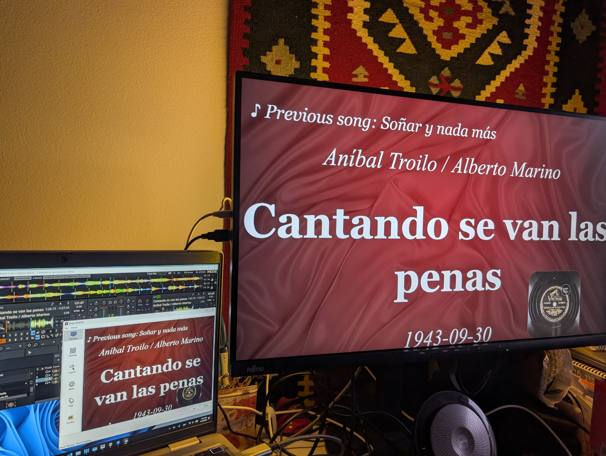
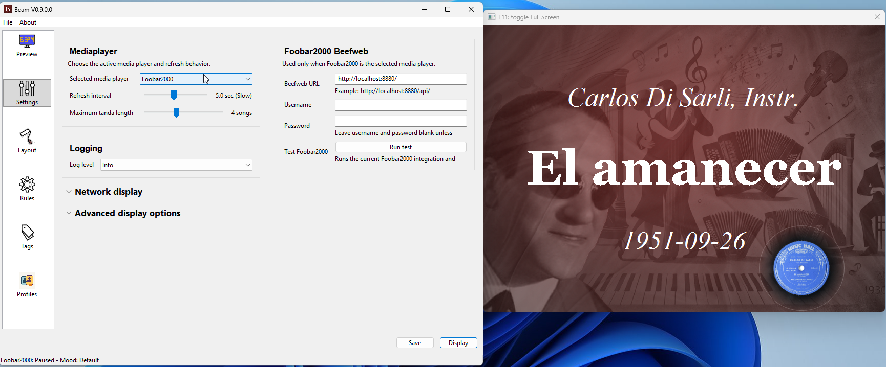
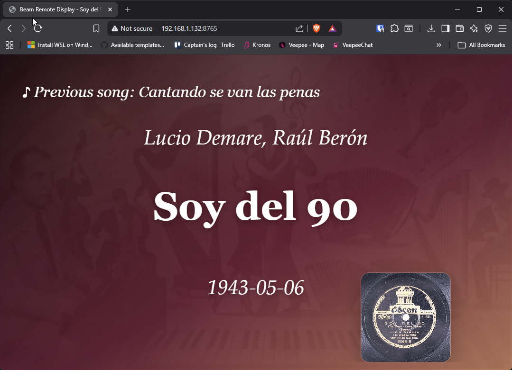

# Beam

Beam can show the current tango, cortina, and next tanda information on a second screen, projector, TV, or browser display in a local network!

It is made for milongas and tango events, but it can also be used anywhere you want a clean live display of the music that is currently playing in your player.

## What Beam Can Do

- Show artist, orchestra, title, year, and previous song information live
- Use a second screen or projector for the audience display
- Let you customize backgrounds, text layout, and moods
- Support browser and tablet display over the local network
- Work with several popular music players, including Foobar2000, VirtualDJ, JRiver, Mixxx, MediaMonkey, and more
- Use and configure DMX lights (only supported in macOS and Linux)

## Who Beam Is For

Beam is designed for DJs, teachers, oprganizers and whoever wants a clear and attractive song display without needing to edit code or deal with complicated technical setup every time.

If you can start your music player and use a settings window, you can use Beam.

## Quick Start

1. Start Beam.
2. Open `Settings` and choose your music player.
3. Apply the settings.
4. Start playing a track in your player.
5. Check that the Beam preview shows the song information.
6. Open the Beam display window.
7. Move the display window to your projector, TV, or second screen.

If Beam shows the current song in the preview, you are ready to use it live.

## Setup Guides

Choose the guide that matches your player:

- Foobar2000: see [docs/FOOBAR_MODULE.md](docs/FOOBAR_MODULE.md)
- Mixxx: see [docs/MIXXX_MODULE.md](docs/MIXXX_MODULE.md)
- VirtualDJ: see [docs/VIRTUALDJ_MODULE.md](docs/VIRTUALDJ_MODULE.md)
- Browser or tablet display: see [docs/NETWORK_DISPLAY.md](docs/NETWORK_DISPLAY.md)
- Quick start for DJs: see [wiki/Quick Start Guide.md](wiki/Quick%20Start%20Guide.md)
- Full user manual: see [wiki/User Manual - Start Here.md](wiki/User%20Manual%20-%20Start%20Here.md)

## Supported Players

Supported does not mean they have been intensive tested. If you find any issue, you can report it in:

https://github.com/MrNidnan/beam-project/issues

### Windows

- Foobar2000
- VirtualDJ
- JRiver
- MediaMonkey
- Mixxx
- Spotify
- Winamp / AIMP
- Icecast

### macOS

- iTunes
- Decibel
- Swinsian
- Vox
- VirtualDJ
- Spotify
- Embrace
- Mixxx
- Icecast
- JRiver

### Linux

- Audacious
- Banshee
- Clementine
- Rhythmbox
- Spotify
- Mixxx
- Icecast
- Strawberry

## Customizing the Display

Beam lets you change:

- the text shown on screen
- the font size and position
  - Layout positions use percentages
- the mood or style of the display
- background images
- artist or orchestra overlays
- profiles for different events or venues

## Browser and Tablet Display

Beam can also publish the current display over your local network, so a phone, tablet, or another browser can show the same information.

This is useful for:

- a tablet at the DJ table
- a small side display in the venue
- checking the output from another device

## Need Help?

If something does not work, start here:

- [wiki/User Manual - Troubleshooting.md](wiki/User%20Manual%20-%20Troubleshooting.md)
- [wiki/FAQ.md](wiki/FAQ.md)

## For Advanced Users

If you want build instructions, release notes, or technical details:

- Build and release notes: [BUILD.md](BUILD.md)
- Change history: [CHANGELOG.md](CHANGELOG.md)

Beam also includes an expert-only `DisplayTweaks` section for rendering controls that are hidden behind `Settings > Display Expert Controls > Show expert display tweaks`.

These values are saved in the active profile JSON under `DisplayTweaks` and currently include:

- `BackgroundBitmapCacheLimit`
- `CoverArtCornerRadius`
- `CoverArtFeatherAmount`
- `CoverArtOutlineEnabled`
- `CoverArtOutlineAlpha`
- `CoverArtOutlineWidth`

`CoverArtCornerRadius` and `CoverArtFeatherAmount` accept either `auto` or a numeric pixel value.

## Documentation Map

- Start here: [wiki/User Manual - Start Here.md](wiki/User%20Manual%20-%20Start%20Here.md)
- Short version: [wiki/Quick Start Guide.md](wiki/Quick%20Start%20Guide.md)
- Daily use: [wiki/User Manual - Daily Use.md](wiki/User%20Manual%20-%20Daily%20Use.md)
- Customizing the display: [wiki/User Manual - Customize the Display.md](wiki/User%20Manual%20-%20Customize%20the%20Display.md)
- Browser and tablet display: [wiki/User Manual - Browser and Tablet Display.md](wiki/User%20Manual%20-%20Browser%20and%20Tablet%20Display.md)
- Player setup overview: [wiki/User Manual - Player Setup.md](wiki/User%20Manual%20-%20Player%20Setup.md)
- Troubleshooting: [wiki/User Manual - Troubleshooting.md](wiki/User%20Manual%20-%20Troubleshooting.md)

## License

This fork is licensed under the GNU General Public License, version 2 or later.

See `LICENSE.md` for details.
