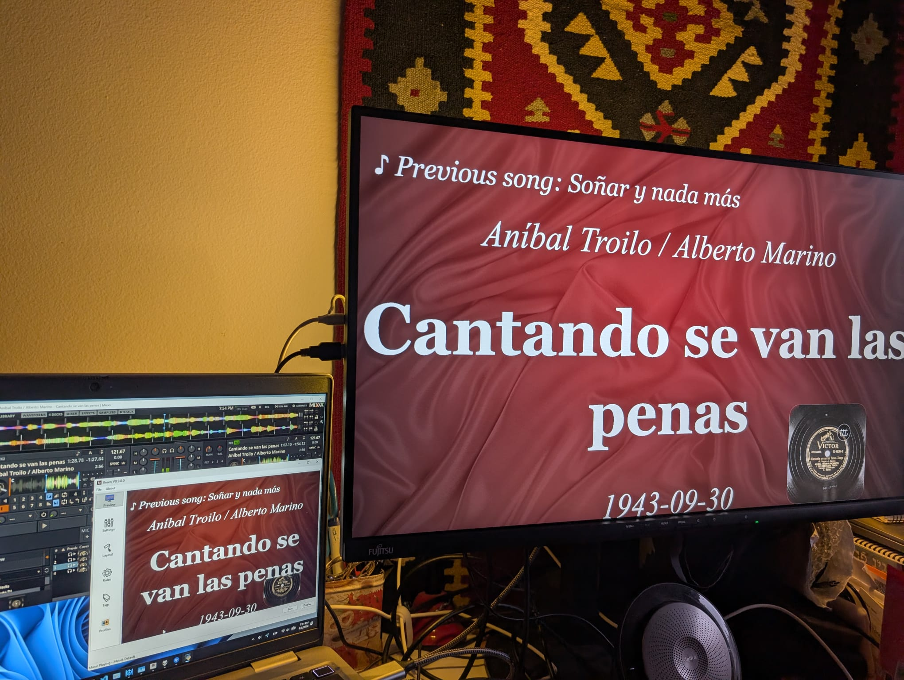
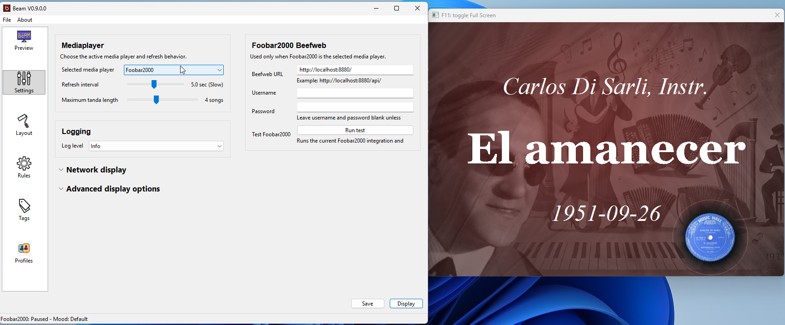
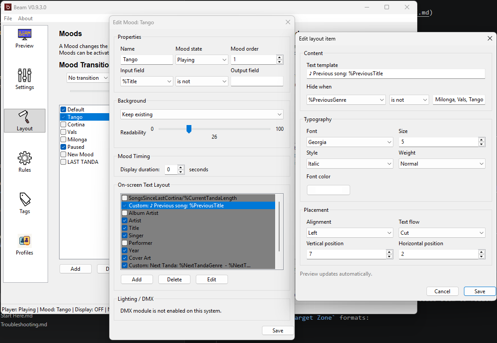
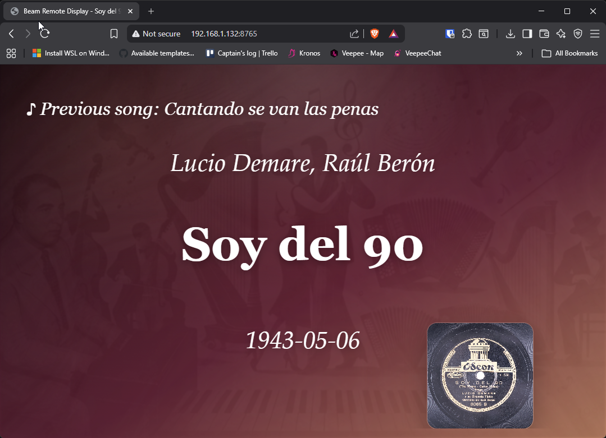

# Beam

Beam can show the current tango, cortina, and next tanda information on a second screen, projector, TV, or browser display in a local network!

It is made for milongas and tango events, but it can also be used anywhere you want a clean live display of the music that is currently playing in your player.



## What Beam Can Do

- Show artist, orchestra, title, year, and previous song information live
- Use a second screen or projector for the audience display
- Let you customize backgrounds, text layout, and moods
- Support browser and tablet display over the local network
- Work with several popular music players, including Foobar2000, VirtualDJ, JRiver, Mixxx, MediaMonkey, and more
- Use and configure DMX lights (only supported in macOS and Linux)

## Who Beam Is For

Beam is designed for DJs, teachers, oprganizers and whoever wants a clear and attractive song display without needing to edit code or deal with complicated technical setup every time.

If you can start your music player and use a settings window, you can use Beam.

## Quick Start

1. Start Beam.
2. Open `Settings` and choose your music player.
3. Apply the settings.
4. Start playing a track in your player.
5. Check that the Beam preview shows the song information.
6. Open the Beam display window.
7. Move the display window to your projector, TV, or second screen.



If Beam shows the current song in the preview, you are ready to use it live.

## Setup And Configuration

Choose the shortest path that matches what you need:

- First event setup: see [wiki/Quick Start Guide.md](wiki/Quick%20Start%20Guide.md)
- Full user manual: see [wiki/User Manual - Start Here.md](wiki/User%20Manual%20-%20Start%20Here.md)
- Player setup overview: see [wiki/User Manual - Player Setup.md](wiki/User%20Manual%20-%20Player%20Setup.md)
- Display customization: see [wiki/User Manual - Customize the Display.md](wiki/User%20Manual%20-%20Customize%20the%20Display.md)

## Supported Players

Supported does not mean they have been intensive tested. If you find any issue, you can report it in:

https://github.com/MrNidnan/beam-project/issues

### Windows

- Foobar2000
- VirtualDJ
- JRiver
- MediaMonkey
- Mixxx
- Spotify
- Winamp / AIMP
- Icecast
- Now Playing (SMTC) — (reads the OS media session of almost any app/browser, that's Spotify Desktop, Youtube Music, Amazon Music, Apple Music, Tidal, Deezer ...)

### macOS

- iTunes
- Decibel
- Swinsian
- Vox
- VirtualDJ
- Spotify
- Embrace
- Mixxx
- Icecast
- JRiver

### Linux

- Audacious
- Banshee
- Clementine
- Rhythmbox
- Spotify
- Mixxx
- Icecast
- Strawberry
- Now Playing (MPRIS) — reads the OS media session of almost any app/browser

## Customizing the Display

Beam lets you change:

- the text shown on screen
- the font size and position
  - Layout positions use percentages
- the mood or style of the display
- background images
- artist or orchestra overlays
- profiles for different events or venues



## Live Display Controls

The buttons at the bottom of the main window give you instant, manual control of
the projected display. These controls are temporary overrides: they do not change
your moods, rules, player state, or background rotation, which keep running
underneath. Nothing here is saved — everything resets to inactive when Beam starts.

- **Show Message** — opens a small dialog to type a message and pick how long it
  stays on screen (5–60 seconds, default 15). The message appears centered, in
  large white text, on the preview, the projector, and the browser display. It
  disappears automatically when the time runs out. While a message is showing,
  the button becomes **Clear Message** so you can remove it early.
- **Display** — shows or hides the projector window, as before.
- **Blackout** — instantly turns the projected display fully black. Your moods,
  rules, and rotation keep running in the background; only the output is hidden.
  While active the button becomes **Resume**; press it to return to the live
  display. A temporary message still appears on top of a blackout.

### Status bar

The bottom status bar summarizes the current state at a glance:

```
Player: Playing | Mood: Tango | Display: ON | Network: OFF
```

- **Player** — current playback status from your music player.
- **Mood** — the mood currently selected for the display.
- **Display** — `ON` when the projector window is open, `OFF` when closed, or
  `BLACKOUT` while blackout is active.
- **Message** — only shown while a temporary message is active; counts down the
  seconds remaining, e.g. `Message: 12s`.
- **Network** — `ON` when the browser/tablet display is enabled, otherwise `OFF`.

## Browser and Tablet Display

Beam can also publish the current display over your local network, so a phone, tablet, or another browser can show the same information.
Make sure you have the firewall port open if erun under Linux!

This is useful for:

- a tablet at the DJ table
- a small side display in the venue
- checking the output from another device



## Need Help?

If something does not work, start here:

- [wiki/User Manual - Troubleshooting.md](wiki/User%20Manual%20-%20Troubleshooting.md)
- [wiki/FAQ.md](wiki/FAQ.md)

## If Packaging Does Not Work, Run Beam locally from source

For Windows and Linux the commands are basically the same.
The current fork is meant to be run from the repository root with Python 3 and the dependencies listed in `requirements.txt`.

Clone or download the repository, then open a terminal in the project root and create a virtual environment.

#### Windows

```powershell
py -m venv .venv
.\.venv\Scripts\Activate.ps1
python -m pip install --upgrade pip
pip install -r requirements.txt
python .\beam.py
```

#### Linux

```bash
python3 -m venv .venv
source .venv/bin/activate
python -m pip install --upgrade pip
pip install -r requirements.txt
python beam.py
```

#### MacOS

- macOS packaging guide for collaborators: [docs/BUILD_MACOS.md](docs/BUILD_MACOS.md)

More details in:

- Build and release notes: [BUILD.md](BUILD.md)

This is the recommended fallback for developers and for users on platforms where packaging is incomplete.

## Advanced Configuration

If you want rendering controls or technical details:

Beam also includes an expert-only `DisplayTweaks` section for rendering controls that are hidden behind `Settings > Display Expert Controls > Show expert display tweaks`.

These values are saved in the active profile JSON under `DisplayTweaks` and currently include:

- `BackgroundBitmapCacheLimit`
- `CoverArtCornerRadius`
- `CoverArtFeatherAmount`
- `CoverArtOutlineEnabled`
- `CoverArtOutlineAlpha`
- `CoverArtOutlineWidth`

`CoverArtCornerRadius` and `CoverArtFeatherAmount` accept either `auto` or a numeric pixel value.

## License

This fork is licensed under the GNU General Public License, version 2 or later.

See `LICENSE.md` for details.

## Changelog

- Change history: [CHANGELOG.md](CHANGELOG.md)
