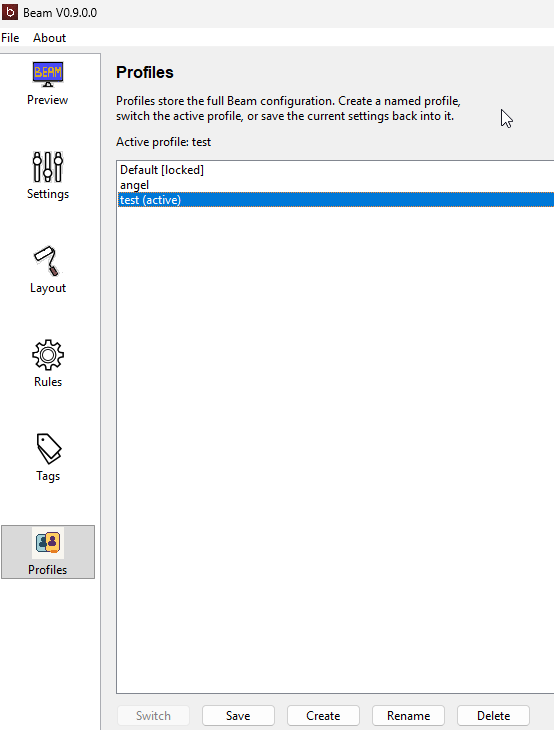
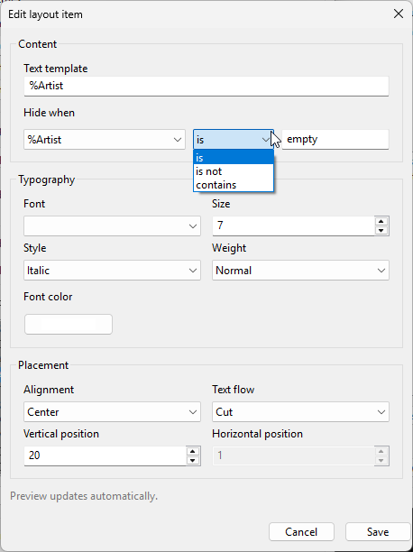
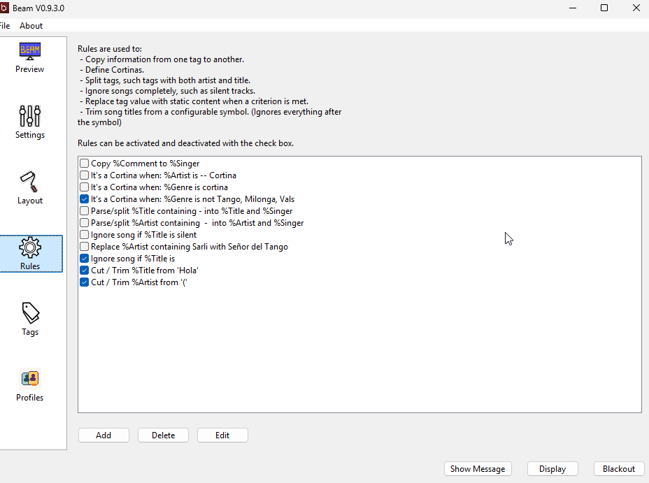

# Features

A practical tour of what Beam can do. Everything here is in the current Beam.

## Player integrations

Beam reads the current song from your music player. It works with several popular
players plus a system-wide **Now Playing** source that follows almost any app.
See the full list and setup notes in [Player Support](../player-support).

## Moods

Moods let Beam switch the display style automatically based on the current song or
playback state. Each mood can have its own matching rule, layout, background, and
DMX color, plus an optional timer.

**Timed moods** keep a special layout on screen for a set number of seconds after
a track change, then fall back to your default mood. Great for short cues like
`LAST TANDA`. See [Moods and Backgrounds](../moods-and-backgrounds).

## Profiles

Keep separate, named setups for different venues, DJs, projectors, or event
styles — for example one profile for a formal milonga and one for practica nights.
Create, switch, rename, and delete profiles in Preferences.



## Layout customization

Decide where each piece of song information appears and how it looks: the text
shown, font size and position, fonts and colors, and alignment. Layout positions
use percentages, so they scale to any screen. Long titles wrap instead of being
cut off.



## Backgrounds

Each mood can use one of four background types:

- **Keep existing** — leave whatever is already on screen (with an optional
  readability blur/dim)
- **Color** — a solid color
- **Single image** — one picture
- **Image slideshow** — rotate through a folder of images

There is also a **Readability** slider for the "Keep existing" mode that blurs and
dims the current background so text stays legible. See
[Moods and Backgrounds](../moods-and-backgrounds).

## Artist / orchestra backgrounds

Beam can show an extra background layer based on the current artist or orchestra,
blended over (or replacing) the mood background. Useful for a per-orchestra look.


## Cover art

Beam can show album cover art, and it preserves the real aspect ratio instead of
forcing a square. Optional outline, rounded corners, feathering, and opacity are
available. Cover art can also be used as the artist background.

## Browser / network display

Publish the same live display to phones, tablets, side monitors, or any browser on
your local network — with low latency and multiple devices at once. See
[Network Display](../network-display).


## Live display controls

Quick buttons for instant, manual control of the projected screen:

- **Show Message / Clear Message** — a centered temporary message (5–60 seconds)
- **Display** — show or hide the projector window
- **Blackout / Resume** — black out the output instantly

These are temporary overrides; they do not change your moods, rules, player state,
or background rotation. See [Live Display Controls](../live-display-controls).

## Status bar

The bottom status bar summarizes what the audience is seeing at a glance:

```
Player: Playing | Mood: Tango | Display: ON | Network: OFF
```

## Auto-save

There is no Save button. Changes apply immediately on the display and are saved
automatically when you close Beam.

## Rules and hide conditions

Rules clean up or reinterpret song metadata before it is shown — detect cortinas,
split combined artist/title text, ignore unwanted tracks, replace values, or trim
trailing text from titles with the **Cut / Trim** rule.

Layout items can be hidden with flexible tag / operator / value conditions,
including comma-separated lists. Example:

```
%PreviousGenre is Milonga, Tango, Vals
```

Beam reads that as: previous genre is Milonga **or** Tango **or** Vals.



## Played history (session history)

Beam can auto-save the songs you played during a session so you have a setlist
afterwards. Turn it on in `Settings > Played History`. One Beam run produces one
set of files named by the session start time, in any combination of **Text log**,
**CSV**, and **M3U8 playlist**.

The text and CSV logs also record events like player changes, pause/stop/resume,
display opened, and blackout/messages — so the log reads like a timeline of the
night. The M3U8 playlist is best-effort: it only includes tracks for which your
player exposes a real local file path.

## Log viewer

Watch Beam's log live, which helps when troubleshooting. Open it from
`Help > Open Log Viewer`.

## DMX lighting (macOS and Linux)

Beam can drive DMX lights with mood-based color changes. This is supported on
macOS and Linux only.

---

[Home](../) ·
[Download](../download) ·
[Getting Started](../getting-started) ·
[Features](../features) ·
[Player Support](../player-support) ·
[Network Display](../network-display) ·
[Live Display Controls](../live-display-controls) ·
[Moods & Backgrounds](../moods-and-backgrounds) ·
[Troubleshooting](../troubleshooting) ·
[Changelog](../changelog)
