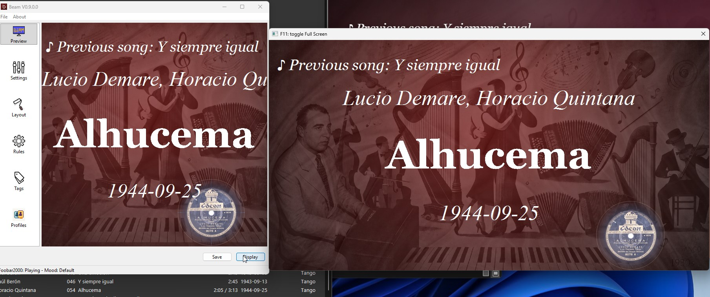

# Getting Started

This page gets Beam working for a live event in a few minutes. You are ready when
Beam shows your current song and the display is on your projector, TV, or second
screen.

## 1. Install and launch Beam

Get Beam from the [Download](../download) page and start it.

## 2. Choose your music player

1. Open `Settings`.
2. Choose the music player you use live (for example Foobar2000, VirtualDJ,
   JRiver, Mixxx, or **Now Playing**).
3. Click `Apply`.

Some players need a little setup. See [Player Support](../player-support) for the
notes for your player.

## 3. Play a song and check the preview

1. Start playing a track in your player.
2. Look at the Beam preview. It should show the current song information.

If the preview shows the song, the connection is working.

## 4. Open the display

1. Click `Display` to open the audience screen.
2. Move that window to your projector, TV, or second monitor.
3. Press `F11` to toggle full screen if you need it.

## 5. Select a mood

Moods change the look of the display. Pick a mood that fits the night, or leave
the default mood. Any change is shown on the display right away.

More on this in [Moods and Backgrounds](../moods-and-backgrounds).

## 6. Test your text output

Before guests arrive, check these four things:

- the correct music player is selected
- a song appears in the preview
- the display is on the correct screen
- the text is readable from the back of the room

## 7. (Optional) Open the network display

Want the same screen on a tablet or phone? Enable the browser/network display and
open the address Beam shows you on another device on the same Wi-Fi.

Full steps in [Network Display](../network-display).

## Where to go next

- [Features](../features) — what else Beam can do
- [Moods and Backgrounds](../moods-and-backgrounds) — customize the look
- [Live Display Controls](../live-display-controls) — messages and blackout
- [Player Support](../player-support) — setup notes per player
- [Troubleshooting](../troubleshooting) — if something does not work

---

[Home](../) ·
[Download](../download) ·
[Getting Started](../getting-started) ·
[Features](../features) ·
[Player Support](../player-support) ·
[Network Display](../network-display) ·
[Live Display Controls](../live-display-controls) ·
[Moods & Backgrounds](../moods-and-backgrounds) ·
[Troubleshooting](../troubleshooting) ·
[Changelog](../changelog)
