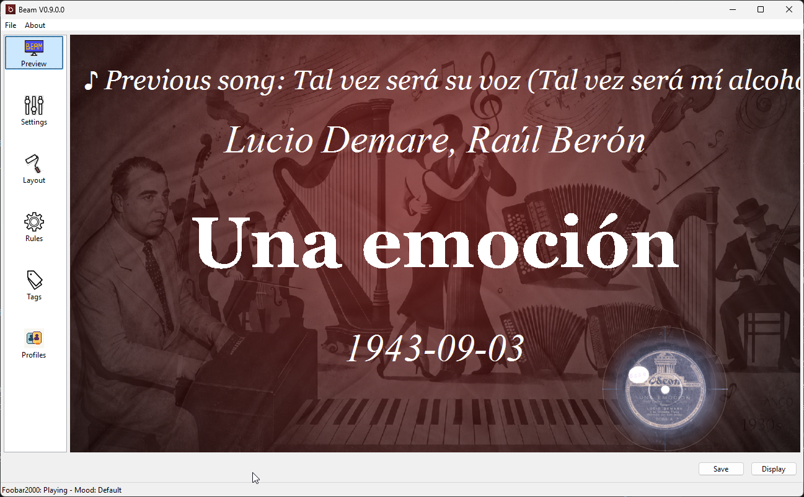
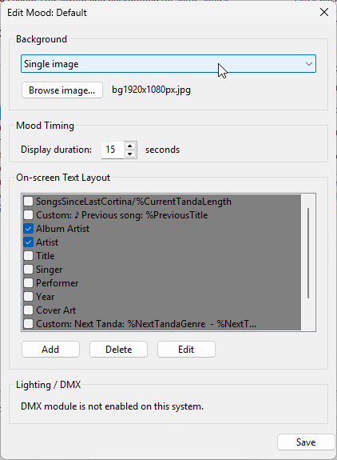
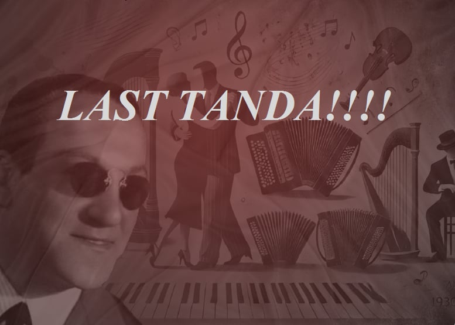
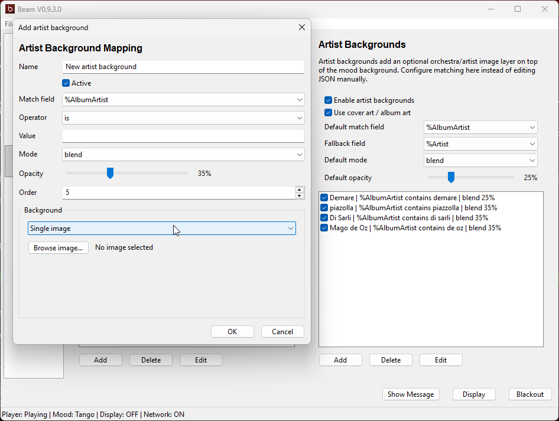

# Moods and Backgrounds

Moods and backgrounds are how you make Beam fit the style of your event. Any change
you make is shown on the display right away.

## What moods are

A mood is a complete look for the display. Beam can switch moods automatically
based on the current song or playback state. Each mood can define:

- its own matching rule
- its own layout
- its own background
- its own DMX color settings (macOS/Linux)
- an optional **Mood Timing** (timer)

## Timed moods (Mood Timing)

**Mood Timing** is measured in seconds:

- `0` — the mood stays active until the next normal song or playback change.
- Greater than `0` — Beam keeps that mood's layout on screen for that many seconds
  after a track change, then falls back to your default mood layout and background.
  The current song info keeps showing, just with the default styling.

This is great for a short cue on a new song, intro, or event moment that then
returns to your normal display automatically.

### Example: a temporary "LAST TANDA" message

1. Create a dedicated mood for the message.
2. Put the message text directly in one or more layout items.
3. Set its background to **Keep existing** and raise **Readability** so the text
   is clearly legible over the current background.
4. Give it a **Mood Timing** of, say, 20 seconds.
5. Enable it when you want the message; it clears itself when the timer ends.

> For quick, unplanned messages you can also use the **Show Message** button — see
> [Live Display Controls](../live-display-controls).

## Background modes

In the mood editor, the **Background type** dropdown picks one of four types, and
only the controls for that type are shown:

- **Keep existing** — does **not** change the background. The mood leaves whatever
  is already on screen in place. Ideal for timed message moods that overlay text
  without swapping the background. Shows the **Readability** slider.
- **Color** — a solid color. Shows a color swatch button that opens the picker.
- **Single image** — one image file (no rotation). Shows a `Browse image...`
  button.
- **Image slideshow** — rotate through all images in a folder. Shows
  `Choose folder...`, a `Change image every` interval, and a `Random order`
  checkbox.

You can use bundled Beam backgrounds, your own imported images, or a rotating
folder.

## Readability slider

When the background type is **Keep existing**, a single **Readability** slider
(`0`–`100`) blurs and dims the current background so on-screen text stays legible —
without replacing the background:

- `0` — no change at all.
- Higher values increase blur and darkening together.
- `100` — strong blur and strong darkening.

This works the same on the projector (native) display and on the browser/tablet
display.

## Artist / album-artist backgrounds

Beam can show an extra background layer based on the current artist or orchestra,
on top of (or replacing) the mood background. Matching prefers the album artist
first, then falls back to the artist. Useful for a per-orchestra look over a venue
slideshow.

## Cover art as background

Cover art / album art can be used as the artist background. It takes the default
blend/replace mode and opacity; if you have defined a specific artist background,
that one wins over cover art.

## Practical examples for milongas

- **Keep a venue slideshow most of the night, show song info only sometimes:**
  use a default slideshow mood with no text, and a separate timed mood with the
  song layout and **Keep existing** + readability for when you want to reveal the
  track.
- **Per-orchestra atmosphere:** map artist backgrounds for your most-played
  orchestras and blend them over the mood background.
- **Different style per genre:** use mood matching rules so tango, vals, and
  milonga each get their own look.

---

[Home](../) ·
[Download](../download) ·
[Getting Started](../getting-started) ·
[Features](../features) ·
[Player Support](../player-support) ·
[Network Display](../network-display) ·
[Live Display Controls](../live-display-controls) ·
[Moods & Backgrounds](../moods-and-backgrounds) ·
[Troubleshooting](../troubleshooting) ·
[Changelog](../changelog)
