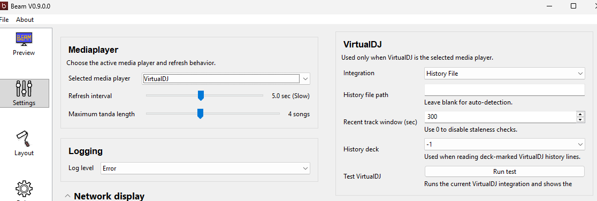
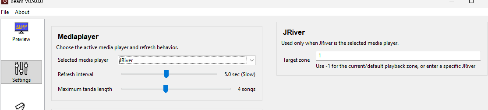
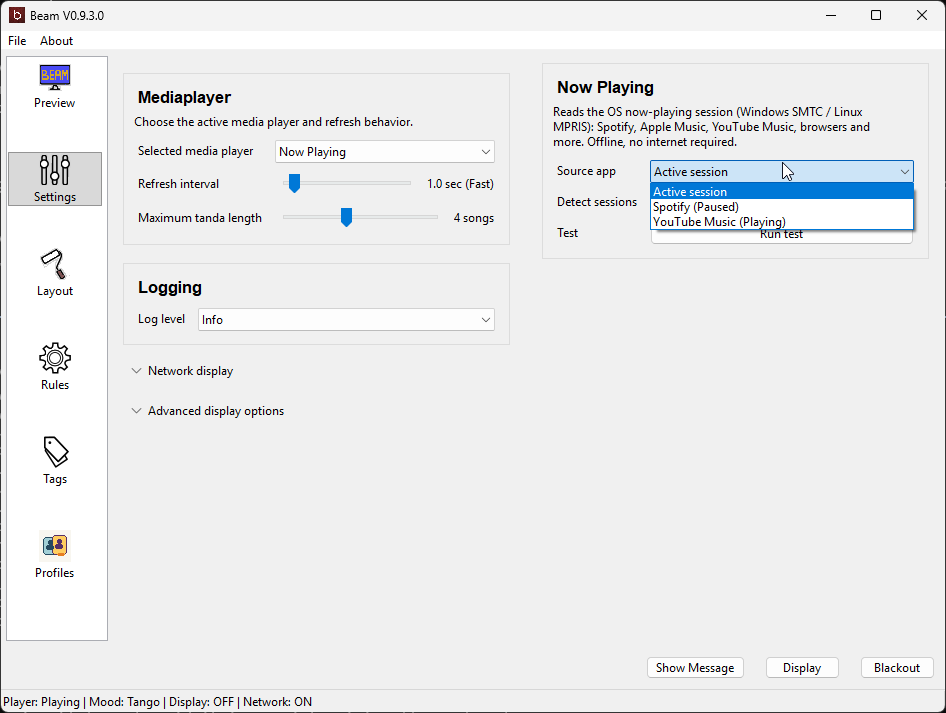

# Player Support

Beam reads the current song from your music player. "Supported" means Beam has a
module for that player — it does not mean every version has been heavily tested.
If you hit a problem, please report it:
<https://github.com/MrNidnan/beam-project/issues>

## Which one should I choose?

Choose the player you already use live. The easiest setup is usually the one that
needs the fewest extra tools and changes to your current workflow. If you just want
Beam to follow whatever is playing, try **Now Playing**.

## Quick matrix

| Player / source | Windows | macOS | Linux | Notes |
|---|---|---|---|---|
| Foobar2000 | ✅ | — | — | Uses the Beefweb component |
| VirtualDJ | ✅ | ✅ | — | History file or network control |
| JRiver | ✅ | ✅ | — | Direct + MCWS; zone support |
| Mixxx | ✅ | ✅ | ✅ | Reads the local `mixxxdb.sqlite` |
| MediaMonkey | ✅ | — | — | Not for portable installs |
| AIMP / Winamp | ✅ | — | — | AIMP added for Windows |
| iTunes | ✅ | ✅ | — | |
| Spotify | ✅ | ✅ | ✅ | |
| Icecast | ✅ | ✅ | ✅ | Stream source |
| Now Playing (SMTC / MPRIS) | ✅ | — | ✅ | System-wide; follows almost any app |
| Cog / Decibel / Swinsian / Vox / Embrace | — | ✅ | — | macOS native players |
| Audacious / Banshee / Clementine / Rhythmbox / Strawberry | — | — | ✅ | Linux native players |

A blank cell means there is no dedicated module for that platform.

## Foobar2000 (Windows)

Foobar2000 support uses the **Beefweb** component. Use this for a stable Windows
setup if you are comfortable installing one Foobar2000 component.

- Beam connects to one Beefweb server URL.
- If you run a second foobar2000 instance for prelisten, make sure only the main
  playback instance is exposed through the Beefweb URL Beam uses.
- You can save the Beefweb URL, username, and password in Beam Preferences.

Full details: [FOOBAR_MODULE.md](../FOOBAR_MODULE)

## VirtualDJ (Windows, macOS)

VirtualDJ works in two modes:

- **History File** — usually the easiest starting point.
- **Network Control**

Beam also offers a deck selector and cover art from history parsing.

Full details: [VIRTUALDJ_MODULE.md](../VIRTUALDJ_MODULE)

## JRiver (Windows, macOS)

On Windows, Beam talks to JRiver directly and also uses **MCWS** when available.
On macOS, Beam uses JRiver's local MCWS connection. MCWS is JRiver's built-in web
control option; turning it on lets Beam read JRiver more reliably.

- Leave **Target Zone** at `-1` to follow JRiver's current/default zone.
- You can also target a zone by index (`index:1`), name (`name:Main Speakers`),
  or id (`id:123456789`). Useful when you have a separate prelisten zone.
- Enable MCWS in `Tools > Options > Media Network` and make sure reading access is
  set to "Everyone".

## Mixxx (Windows, macOS, Linux)

Beam reads Mixxx from its local `mixxxdb.sqlite` database. It auto-detects the
path, and you can override it in `Preferences > Basic Settings > Mixxx`.

- Use **Run test** to see the database path, playback status, and current metadata.
- Behavior depends on how Mixxx history and Auto DJ are configured.
- **Limitation:** `Next Tanda` can be inaccurate because Beam reads history + the
  Auto DJ queue rather than a live deck API.

Full details: [MIXXX_MODULE.md](../MIXXX_MODULE)

## MediaMonkey (Windows)

Supported. Do **not** use a portable installation if you want the normal
MediaMonkey integration.

## iTunes, Spotify, AIMP, Icecast and native players

- **iTunes** — Windows and macOS.
- **Spotify** — supported; also readable through Now Playing.
- **AIMP / Winamp** — Windows.
- **Icecast** — stream source on all platforms.
- **macOS native:** Cog, Decibel, Swinsian, Vox, Embrace.
- **Linux native:** Audacious, Banshee, Clementine, Rhythmbox, Strawberry.

## Now Playing (SMTC / MPRIS)

Use **Now Playing** when you just want Beam to follow whatever your computer is
already playing, without setting up a specific player. It reads the operating
system's own media session — no account, internet, or API key.

- **Windows** reads the **SMTC** session (the same info in the volume/media flyout).
- **Linux** reads the **MPRIS** session over D-Bus.

### What works

Almost any app that publishes an OS media session: Spotify, Apple Music (Windows),
Amazon Music, YouTube Music desktop, TIDAL, Deezer, and (on Linux) VLC, mpv,
Rhythmbox, Clementine, Strawberry, Audacious, and more. Browsers (Chrome, Edge,
Firefox) also work while a tab is playing media.

Use **Detect** to list apps publishing a session right now, pick a **Source app**,
or leave it on **Active session** to follow whatever is playing. **Run test** shows
the resolved app, status, and current track.

### Limitations

The OS media session only exposes a few fields, so Beam can usually read **title**,
**artist**, often **album**, sometimes **cover art**, and rarely **genre**. Other
tags that file-based players provide — comment, composer, year, album artist — are
generally **not** available and will be blank.

> **Streaming services:** TIDAL, Qobuz, YouTube Music, Spotify and similar are not
> directly integrated as dedicated players. They **may work through Now Playing**
> if the app or browser exposes OS media metadata. Now Playing does not provide
> file paths, custom tags, or next-track data, so features that need those
> (for example the M3U8 setlist or `Next Tanda`) will be limited.

---

[Home](../) ·
[Download](../download) ·
[Getting Started](../getting-started) ·
[Features](../features) ·
[Player Support](../player-support) ·
[Network Display](../network-display) ·
[Live Display Controls](../live-display-controls) ·
[Moods & Backgrounds](../moods-and-backgrounds) ·
[Troubleshooting](../troubleshooting) ·
[Changelog](../changelog)
