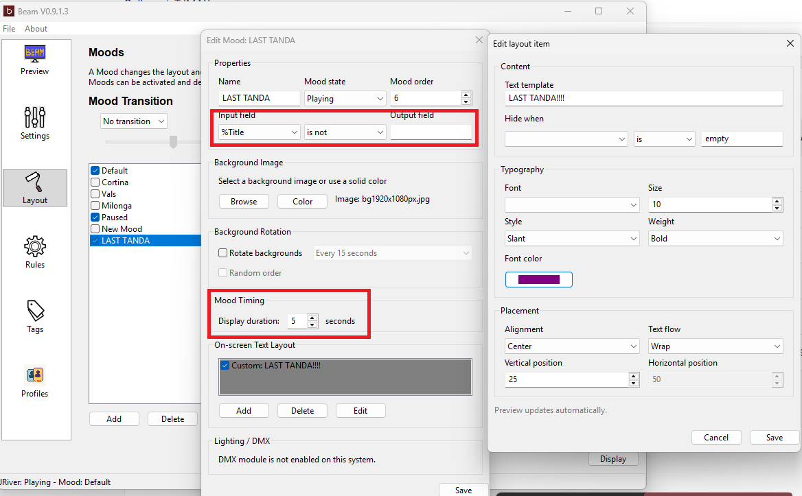

Beam can be configured to show most information about your songs. The tags are parsed in Beam and replaced with the information from the media player.

```
CurrentSong   PreviousSong          NextSong         NextTanda

%Artist       %PreviousArtist       %NextArtist      %NextTandaArtist
%AlbumArtist  %PreviousAlbumArtist  %NextAlbumArtist %NextTandaAlbumArtist
%Album        %PreviousAlbum        %NextAlbum       %NextTandaAlbum
%Title        %PreviousTitle        %NextTitle       %NextTandaTitle
%Genre        %PreviousGenre        %NextGenre       %NextTandaGenre
%Comment      %PreviousComment      %NextComment     %NextTandaComment
%Composer     %PreviousComposer     %NextComposer    %NextTandaComposer
%Performer    %PreviousPerformer    %NextPerformer   %NextTandaPerformer
%Year         %PreviousYear         %NextYear        %NextTandaYear
%Singer       %PreviousSinger       %NextSinger      %NextTandaSinger
%FilePath
%IsCortina    %PreviousIsCortina    %NextIsCortina


You also have the possibility to include time and date. These are controlled with the following tags:
Date and Time
%Hour %Min
%DateDay %DateMonth %DateYear
%LongDate (example: 14th of December)
%FuzzyTime

It is possible to show song count and the dynamic tanda length (number of songs between two cortinas)
Song count
%SongsSinceLastCortina
%CurrentTandaSongsRemaining
%CurrentTandaLength
```

Most media players can only provide a subset of the tags, e.g. Next\* is often not available.

`%FilePath` shows the current track's resolved local file path.
It is mainly useful for diagnostics when you want to verify what Beam is receiving from the active player module.

## Cover Art

Beam also supports a special `%CoverArt` layout tag.

- Add a layout item whose field is exactly `%CoverArt`.
- Beam will draw the current song's album art as an image instead of rendering text.
- The layout item's `Size` controls the image size.
- The layout item's `Position` and `Alignment` control where the image is drawn.

Notes:

- `%CoverArt` is a special image tag, not a normal text replacement tag.
- It works best when the current track has embedded artwork or artwork files that Beam can find next to the audio file.
- Other arbitrary image paths are not currently supported as layout tags; use the mood `Background` setting for static background images.

## Temporary Messages

Beam does not currently have a separate message overlay feature.

A timed mood is the recommended workaround for temporary messages such as `LAST TANDA` or `MIX TANDA`.
A timed mood is less cluttered and more consistent with Beam's current architecture.

Suggested setup:

- Create a dedicated mood for the message.
- Put the message text directly in one or more layout items.
- Set `DisplayTimer` to the number of seconds you want the message to remain visible.
- Enable that mood when you want to show the message, and disable it again when you do not want it available.
  

Example ideas:

- `LAST TANDA`
- `MIX TANDA`
- `CORTINA COMING`

If you want to show both the message and normal song information, copy the usual layout items into that message mood and add the extra message text where you want it to appear.
