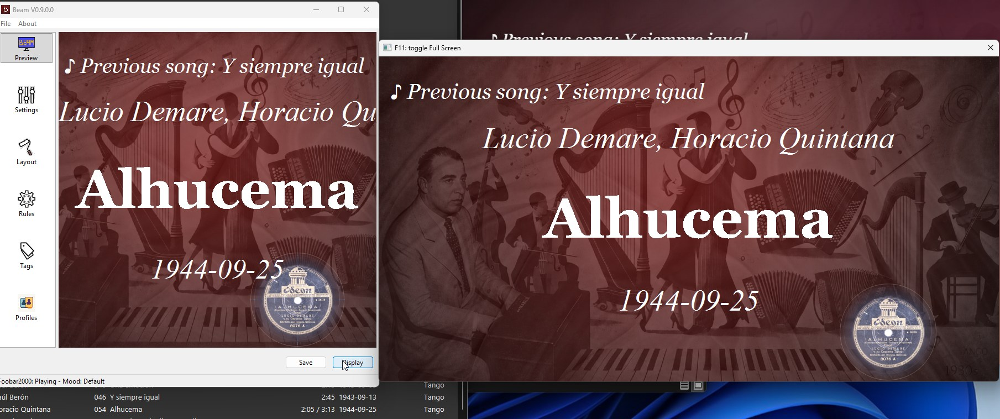

# Quick Start Guide

## Goal

You are ready when:

- Beam shows the current song in the preview
- the display window is open
- the display is on your projector, TV, or second screen

### Notes

## 5-Minute Setup

1. Start Beam.
2. In Beam, choose your music player.
3. Click `Apply`.
4. Start playing a song in your player.
5. Check that Beam shows the song in the preview.
6. Click `Display` to open the audience screen.
7. Move that window to the projector or second monitor.

## Setup And Configuration

Use these pages when you need more than the minimum setup:

- player connection help: [User Manual - Player Setup.md](User%20Manual%20-%20Player%20Setup.md)
- display and layout changes: [User Manual - Customize the Display.md](User%20Manual%20-%20Customize%20the%20Display.md)
- browser and tablet display: [User Manual - Browser and Tablet Display.md](User%20Manual%20-%20Browser%20and%20Tablet%20Display.md)

## Before a Real Event

Test these four things before people arrive:

- the correct music player is selected
- a song appears in the preview
- the display is on the correct screen
- the text is readable from a distance

## If Something Does Not Work

Start here:

- [User Manual - Troubleshooting.md](User%20Manual%20-%20Troubleshooting.md)
- [User Manual - Player Setup.md](User%20Manual%20-%20Player%20Setup.md)

## RUNNING the APP! (If Packaging Does Not Work)

Run Beam from source with the steps in [For Developer.md](For%20Developer.md).

## Want the Full Guide?

Go to [User Manual - Start Here.md](User%20Manual%20-%20Start%20Here.md).
