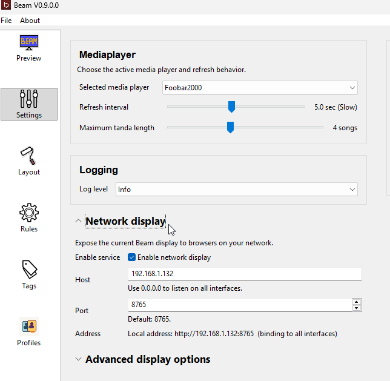

# User Manual: Browser and Tablet Display

Beam can also show the live display in a web browser on your local network.

This is useful for tablets, phones, side monitors, or remote checking.

## When to Use This

Browser display is useful when:

- you want a tablet at the DJ table
- you want a small side display somewhere in the venue
- you want to check the display from another device
- you do not want to rely only on the desktop display window

## Basic Setup

1. Open Beam settings.
2. Enable the network display service.
3. Choose the host and port if needed.
4. Apply the settings.
5. Open the shown Beam address in a browser on another device.

## What You Should See

If it is working, the browser device will show the current song information and background.

It should update when the current track changes.

## If Another Device Cannot Connect

Check:

- Beam is running
- the network display service is enabled
- the device is on the same network
- the host and port are correct
- a firewall is not blocking the connection

If needed, see [../docs/NETWORK_DISPLAY.md](../docs/NETWORK_DISPLAY.md) for deeper technical details.
