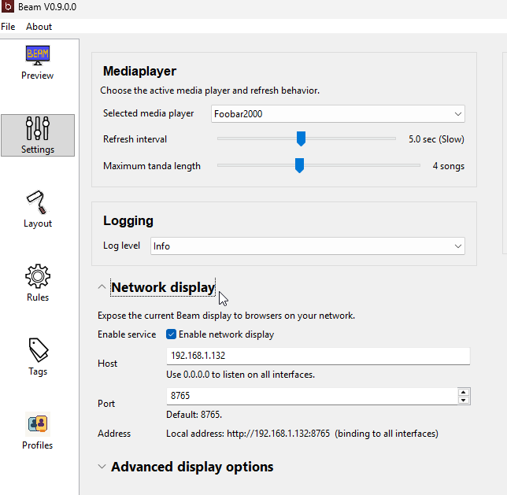
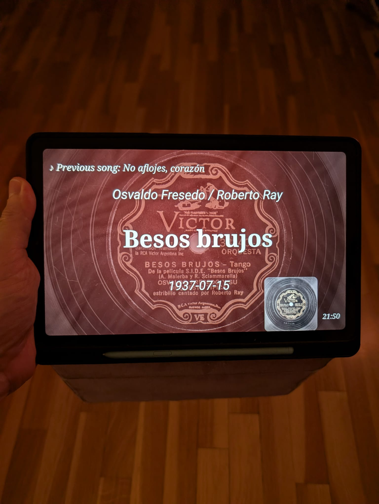

# User Manual: Browser and Tablet Display

Beam can also show the live display in a web browser on your local network.

This is useful for tablets, phones, side monitors, or remote checking as it low latency almost zero cost and you can have multiple displays.

## When to Use This

Browser display is useful when:

- you want a small side display somewhere in the venue
- You want multiple displays
- you want to check the display from another device
- you do not want to rely only on the desktop display window

## Limitation

The obvius limitation is that you must have internet connection. if you plan to use a different device that the one in BEAM. If it's the beam device you can still use the browser in cae you want it for some reason over main display.

## Basic Setup

1. Open Beam settings.
2. Enable the network display service.
3. It will show the local ip network to which you have to connect the browser.
4. Open the shown Beam address in a browser on another device.

## What You Should See

If it is working, the browser device will show the current song information and background.

It should update when the current track changes.

## If Another Device Cannot Connect

Check:

- Beam is running
- the network display service is enabled
- the device is on the same network as dj laptop
- the host and port are correct
- a firewall is not blocking the connection

If needed, see [../docs/NETWORK_DISPLAY.md](../docs/NETWORK_DISPLAY.md) for deeper technical details.
