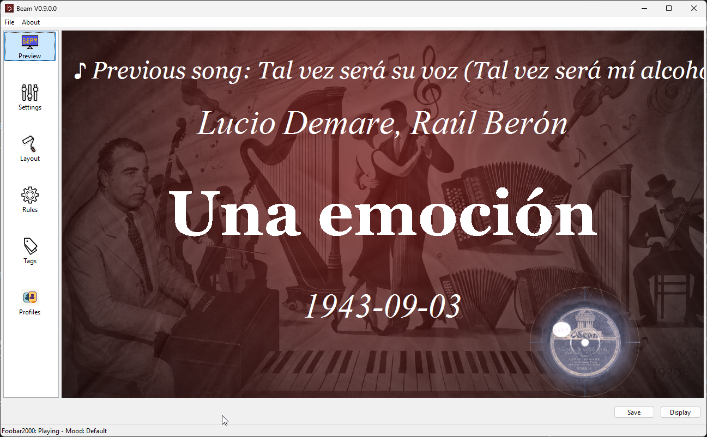
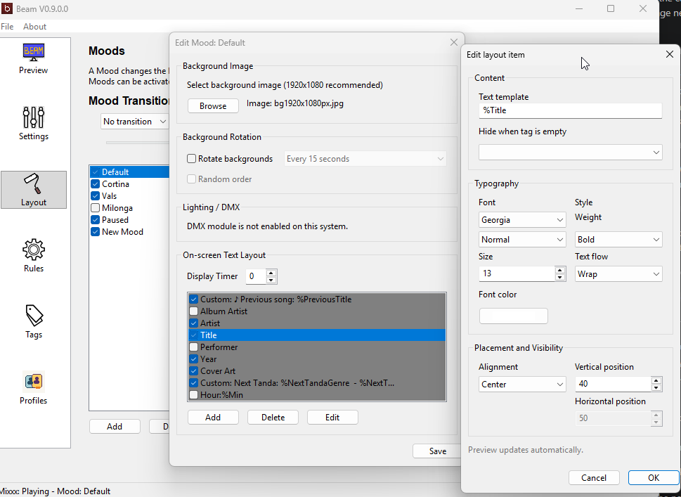
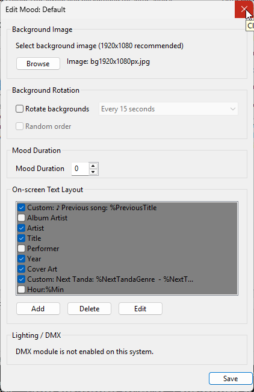
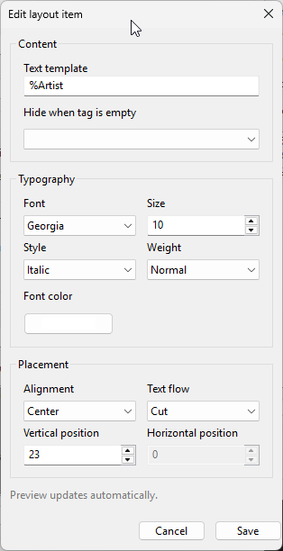
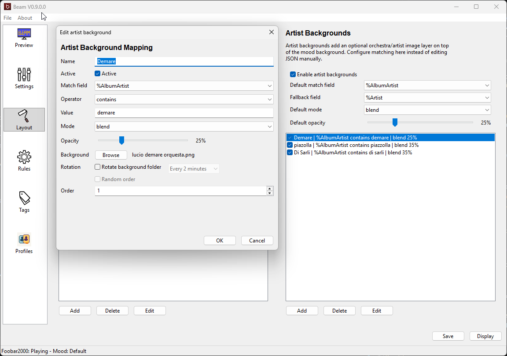
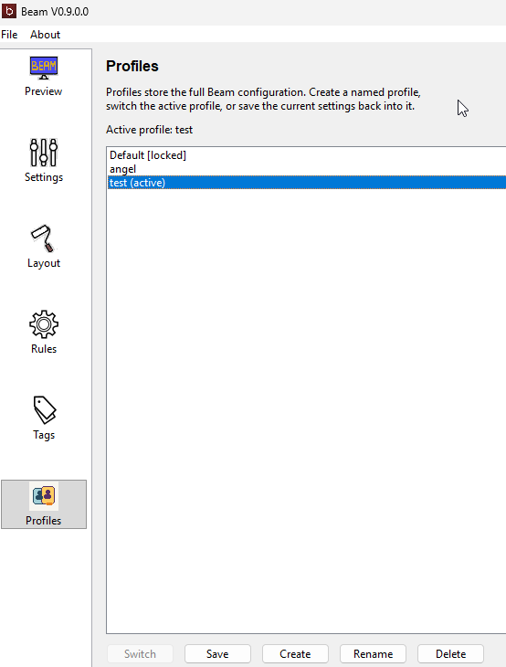
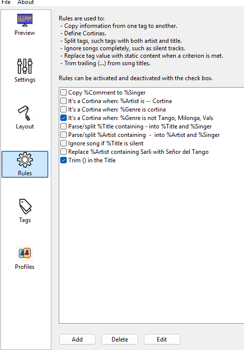
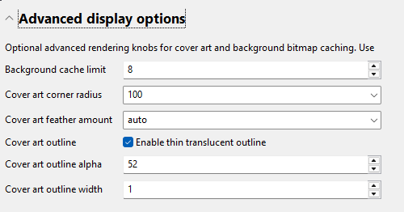

# User Manual: Customize the Display

Beam is designed so you can make the display fit your event style.

## What You Can Customize

You can change:

- the text shown on screen
- text size and position
- fonts and colors
- backgrounds
- moods
- artist or orchestra overlays
- profiles for different venues or events

## Moods

Moods let Beam switch the display style automatically based on the current song or playback state.

Each mood can define:

- its own matching rule
- its own layout
- its own background
- its own DMX color settings
- an optional `Display Timer`

`Modd Timing` is measured in seconds.

- `0` means the mood stays active until the next normal song or playback change.
- A value greater than `0` means Beam will keep that mood layout on screen for that many seconds after the track change.
- When the timer expires, Beam falls back to the default mood layout and default mood background.
- The current song information is still used, so Beam keeps showing the current track with the default mood styling after the timer runs out.

This is useful when you want a special mood to appear briefly for a new song, intro, or event cue, then return automatically to your normal default display style.

## Backgrounds

Beam supports background images for moods.

You can use:

- bundled Beam backgrounds
- your own imported background files
- rotating background folders

## Layout Items

The layout controls decide where and which song information appears on screen.

You can move items like:

- artist or orchestra name
- song title
- year
- previous song

Layout `Position` values are percentages:

- The vertical percent from the top of the display.
- The horizontal percent offset used for left-aligned and right-aligned items.
- Centered items mainly use the vertical value; the horizontal offset is primarily meaningful for left/right alignment.

If you want to know which text tags you can place in the layout, see [Display Tags.md](Display%20Tags.md).

`Next Tanda` tags are calculated from the playlist by looking ahead to the next cortina, then taking the first non-cortina song after it. This is not the same as the current song position inside the tanda. For current tanda progress, use `%SongsSinceLastCortina`, `%CurrentTandaSongsRemaining`, and `%CurrentTandaLength`.

## Artist or Orchestra Overlays

Beam can also show an extra background layer based on the current artist or orchestra.

This is useful if you want a mood background plus a specific orchestra image.

## Profiles

Profiles help you keep different Beam setups for different venues or event styles.

For example:

- one profile for a formal milonga
- one profile for practica nights
- one profile for a browser-only setup

## Rules

Rules let Beam clean up or reinterpret song metadata before it is shown on screen.

For example, you can use rules to:

- detect cortinas
- split combined artist and title text
- ignore unwanted tracks such as silent files
- replace one displayed value with another
- trim trailing `( ... )` text from song titles

For a simple walkthrough, see [User Manual - Rules.md](User%20Manual%20-%20Rules.md).

## Keep Readability First

The most important rule is simple:

Make sure the text is readable from the back of the room.

Choose backgrounds and colors that help the song information stand out clearly.

## Expert Display Tweaks

Beam also has a hidden advanced section in `Settings` for expert rendering tweaks.

Open `Settings`, then expand `Display Expert Controls` and `Show expert display tweaks`.

These controls are meant for operators who want to fine-tune display rendering beyond the normal layout and mood settings.

Current expert controls include:

- background bitmap cache limit
- cover art corner radius
- cover art feather amount
- cover art outline enabled
- cover art outline alpha
- cover art outline width

`Cover art corner radius` and `Cover art feather amount` accept either `auto` or a fixed pixel value.

These values are saved in the active profile JSON under `DisplayTweaks`, so you can adjust them in the UI first and still inspect or copy them by hand later.

## Related Pages

- [User Manual - Daily Use.md](User%20Manual%20-%20Daily%20Use.md)
- [User Manual - Rules.md](User%20Manual%20-%20Rules.md)
- [User Manual - Browser and Tablet Display.md](User%20Manual%20-%20Browser%20and%20Tablet%20Display.md)
- [Display Tags.md](Display%20Tags.md)
- [DMX (lighting control support).md](DMX%20%28lighting%20control%20support%29.md)
