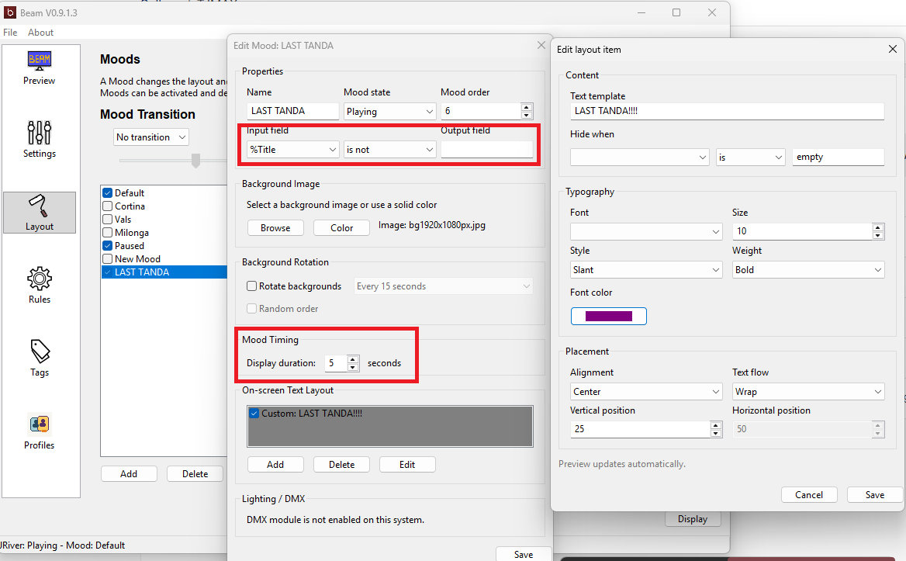
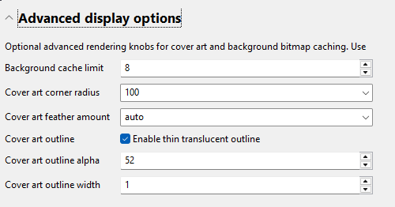

# User Manual: Customize the Display

Beam is designed so you can make the display fit your event style.

Any setting you change that affects display, should be inmediately visible in the display. Acitvating a rule or a mood will be shown in the display inmediately.

## What You Can Customize

You can change:

- the text shown on screen
- text size and position
- fonts and colors
- backgrounds
- moods
- artist or orchestra overlays
- profiles for different venues, events or contexts

## The Layout Page

Open `Settings > Layout`. The page has two columns:

- On the left, a tab pane with the `Moods` and `Artist Backgrounds` tabs, each with its list of items.
- On the right, the editor for the currently selected item.

Select a mood or an artist background in the list and its editor opens on the right — there is no separate edit window and no `Edit` button. Your changes are saved automatically when you select another item, switch tabs, or press `Save`.

- `Add` creates a new item, selects it, and opens it for editing on the right.
- `Delete` removes the selected item (after a confirmation).
- The check box in front of each item activates or deactivates it.

## Moods

Moods let Beam switch the display style automatically based on the current song or playback state.

Each mood can define:

- its own matching rule
- its own layout
- its own background
- its own DMX color settings
- an optional `Display Timer`

`Modd Timing` is measured in seconds.

- `0` means the mood stays active until the next normal song or playback change.
- A value greater than `0` means Beam will keep that mood layout on screen for that many seconds after the track change.
- When the timer expires, Beam falls back to the default mood layout and default mood background.
- The current song information is still used, so Beam keeps showing the current track with the default mood styling after the timer runs out.

This is useful when you want a special mood to appear briefly for a new song, intro, or event cue, then return automatically to your normal default display style.

### Pro tip - Temporary Messages

Beam does not currently have a separate message overlay feature, but you can sue a timed mood for temporary messages such as `LAST TANDA` or `MIX TANDA`.

Suggested setup:

- Create a dedicated mood for the message.
- Put the message text directly in one or more layout items.
- Set `DisplayTimer` to the number of seconds you want the message to remain visible.
- Enable that mood when you want to show the message, and disable it again when you do not want it available.

  
  

Example ideas:

- `LAST TANDA`
- `MIX TANDA`
- `CORTINA COMING`

If you want to show both the message and normal song information, copy the usual layout items into that message mood and add the extra message text where you want it to appear.

## Backgrounds

Beam supports background images for moods.

You can use:

- bundled Beam backgrounds
- your own imported background files
- rotating background folders

### Background Modes

In the mood editor, the `Background` section has a single `Background type` dropdown. Choosing a type reveals only the controls for that type, keeping the editor compact:

- **Keep existing** – does **not** change the background. The mood leaves whatever background is already on screen (from the previous or default mood) in place. This is ideal for timed message moods such as `LAST TANDA`, where you want to show extra text over the current background without swapping it. Shows the `Readability` slider (see below).
- **Color** – use a solid color. Shows a colour swatch button that displays the chosen colour and opens the picker when clicked.
- **Single image** – use one image file. Shows a `Browse image...` button (file picker). No rotation.
- **Image slideshow** – rotate through all images in a folder. Shows `Choose folder...`, a `Change image every` interval, and a `Random order` checkbox.

There is no longer a separate "Background Rotation" section: the rotation interval and random-order options appear only when `Image slideshow` is selected. To switch between a single picture and a rotating folder, just change the `Background type` dropdown.

### Readability

When the background mode is `Keep existing`, a single `Readability` slider (from `0` to `100`) is available. It does not replace the background — it keeps whatever is already on screen and applies a blur plus a dark overlay so on-screen text is easier to read:

- `0` means no change at all.
- Higher values increase both the blur and the darkening together.
- `100` gives a strong blur and strong darkening.

A typical use is a timed message mood: set its background to `Keep existing`, raise `Readability` until the message is clearly legible over the current background, and the underlying background is never swapped.

This works the same way on the projected (native) display and on the browser/tablet display.

## Layout Items

The layout controls decide where and which song information appears on screen. Each mood has its own `On-screen Text Layout` list in the mood editor; `Add` and `Edit` (or a double click) open the layout item editor in its own window, which must be saved or cancelled before you continue. The display preview updates live while you edit.

You can move items like:

- artist or orchestra name
- song title
- year
- previous song

Layout `Position` values are percentages:

- The vertical percent from the top of the display.
- The horizontal percent offset used for left-aligned and right-aligned items.
- Centered items mainly use the vertical value; the horizontal offset is primarily meaningful for left/right alignment.

If you want to know which text tags you can place in the layout, see [Display Tags.md](Display%20Tags.md).

### Adaptive Text Fitting

Beam keeps long text readable automatically:

- Centered text stays inside a safe area (85% of the display width by default), so long titles never touch the screen edges.
- Text always keeps a minimum 5% margin at the top and bottom of the screen: items positioned above the top margin are pushed down to it, and the centered group shrinks until it clears the bottom margin.
- When text does not fit, Beam first shrinks the font (down to 75% of the configured size) before wrapping or ellipsizing.
- Each layout item can set **Max lines** (Auto / 1 / 2 / 3) in the layout item editor. In the default layout the title wraps to at most 2 lines and metadata lines stay on 1 line, ellipsized with `...` if still too long.
- The whole centered text group (artist / title / year) is kept inside the screen: if a wrapped title would push the year or clock off-screen, Beam shrinks the group until everything fits.
- Uncheck **Auto-fit text size** in the layout item editor to disable shrinking for an item. Advanced per-item properties `MinSize` (shrink floor, in the same percent unit as `Size`) and `MaxWidthPercent` (text box width as percent of the display width, e.g. `100` for edge-to-edge) can be set directly in the profile JSON.

The same rules apply on the browser/network display.

`Next Tanda` tags are calculated from the playlist by looking ahead to the next cortina, then taking the first non-cortina song after it. This is not the same as the current song position inside the tanda. For current tanda progress, use `%SongsSinceLastCortina`, `%CurrentTandaSongsRemaining`, and `%CurrentTandaLength`.

## Artist or Orchestra Overlays

Beam can also show an extra background layer based on the current artist or orchestra.

This is useful if you want a mood background plus a specific orchestra image.

Open the `Artist Backgrounds` tab on the `Settings > Layout` page. The tab holds the general settings (enable, cover art, match fields, default mode and opacity) and the list of mappings; selecting a mapping opens its editor on the right, like moods.

## Profiles

Profiles help you keep different Beam setups for different venues or event styles.

For example:

- one profile for a formal milonga
- one profile for practica nights
- one profile for a browser-only setup

## Rules

Rules let Beam clean up or reinterpret song metadata before it is shown on screen.

For example, you can use rules to:

- detect cortinas
- split combined artist and title text
- ignore unwanted tracks such as silent files
- replace one displayed value with another
- trim trailing `( ... )` text from song titles

For a simple walkthrough, see [User Manual - Rules.md](User%20Manual%20-%20Rules.md).

## Keep Readability First

The most important rule is simple:

Make sure the text is readable from the back of the room.

Choose backgrounds and colors that help the song information stand out clearly.

## Expert Display Tweaks

Beam also has a hidden advanced section in `Settings` for expert rendering tweaks.

Open `Settings`, then expand `Display Expert Controls` and `Show expert display tweaks`.

These controls are meant for operators who want to fine-tune display rendering beyond the normal layout and mood settings.

Current expert controls include:

- background bitmap cache limit
- cover art corner radius
- cover art feather amount
- cover art outline enabled
- cover art outline alpha
- cover art outline width

`Cover art corner radius` and `Cover art feather amount` accept either `auto` or a fixed pixel value.

These values are saved in the active profile JSON under `DisplayTweaks`, so you can adjust them in the UI first and still inspect or copy them by hand later.

## Related Pages

- [User Manual - Daily Use.md](User%20Manual%20-%20Daily%20Use.md)
- [User Manual - Rules.md](User%20Manual%20-%20Rules.md)
- [User Manual - Browser and Tablet Display.md](User%20Manual%20-%20Browser%20and%20Tablet%20Display.md)
- [Display Tags.md](Display%20Tags.md)
- [DMX (lighting control support).md](DMX%20%28lighting%20control%20support%29.md)
