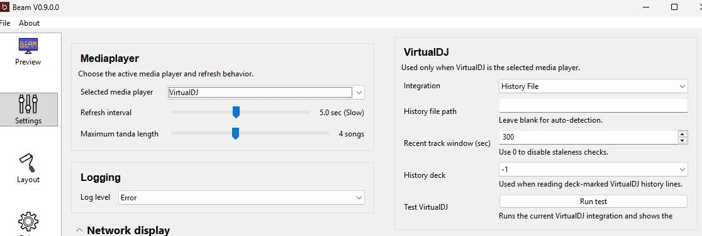
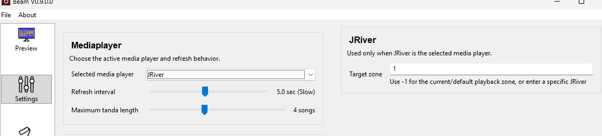

# User Manual: Player Setup

Beam supports several music players. This page helps you choose the right setup guide.

## Foobar2000

Foobar2000 support uses the Beefweb component.

Use this if you want a stable Windows setup and you are comfortable installing one Foobar2000 component.

Beam connects to one Beefweb server URL. If you run a second foobar2000 instance for preview or prelisten, make sure only the main playback instance is exposed through the Beefweb URL Beam uses.

Read: [../docs/FOOBAR_MODULE.md](../docs/FOOBAR_MODULE.md)

## VirtualDJ

VirtualDJ support works in two modes:

- History File
- Network Control

History File is usually the easiest starting point.

Read: [../docs/VIRTUALDJ_MODULE.md](../docs/VIRTUALDJ_MODULE.md)

## JRiver

Beam includes JRiver support.

On Windows, Beam can talk to JRiver directly and will also use MCWS when it is available.
On macOS, Beam uses JRiver's local MCWS connection.

MCWS is JRiver's built-in web control option. For most users, it is enough to know that turning it on lets Beam read JRiver more reliably.

JRiver also exposes a `Target Zone` setting in Beam.

In JRiver, a zone is one playback destination inside the same JRiver instance. It is not a second copy of JRiver. For example, you might have one zone for your main speakers and another for preview headphones or a second device.

For most users, leave `Target Zone` set to `-1`. That tells Beam to follow JRiver's current or default playback zone automatically.

Beam accepts these `Target Zone` formats:

- `-1`
  Follow JRiver's current or default zone.
- `2`
  Follow the second zone in JRiver's zone list. This is the simplest choice when you know the playback zone order.
- `index:1`
  Follow a specific zero-based zone index. `index:0` is the first zone, `index:1` is the second.
- `name:Main Speakers`
  Follow a zone by its JRiver zone name.
- `id:123456789`
  Follow a zone by its JRiver zone ID.

If JRiver is playing to more than one zone and Beam keeps following the wrong one, set `Target Zone` to the zone you want Beam to track. This is mainly useful when you have a separate preview or prelisten zone and want Beam to ignore it.

If you really do have separate JRiver instances running, Beam does not manage them as separate players. It connects to the JRiver instance exposed through the normal local JRiver interfaces and MCWS.

To review or rename zones in JRiver Media Center, open `Player > Zone > Manage Zones`.

If Target Zone selection does not seem to work, enable MCWS first so Beam can resolve JRiver zones more reliably.

To enable MCWS in JRiver Media Center, open `Tools > Options > Media Network` and enable `Use Media Network to share this library and enable DLNA`.

https://wiki.jriver.com/index.php/MCWS_Playback_Info
https://wiki.jriver.com/index.php/MCWS_Playback_Playlist
https://wiki.jriver.com/index.php/MCWS_File_GetInfo

## Mixxx

Mixxx support is useful when Mixxx is your main DJ player.

Beam reads Mixxx from the local `mixxxdb.sqlite` database. By default it auto-detects the database path, but you can now override that path in `Preferences -> Basic Settings -> Mixxx` if your Mixxx installation stores it somewhere else.

Beam prefers the normal per-platform Mixxx database path first and then falls back to other common locations used by newer releases:

- Windows: `%LOCALAPPDATA%\Mixxx\mixxxdb.sqlite`
- macOS: `~/Library/Containers/org.mixxx.mixxx/Data/Library/Application Support/Mixxx/mixxxdb.sqlite`
- Linux: `~/.mixxx/mixxxdb.sqlite`

Beam also checks other common Mixxx locations such as `~/Library/Application Support/Mixxx/mixxxdb.sqlite` on macOS and `~/.local/share/mixxx/mixxxdb.sqlite` on Linux when the default path is not present.

The `Run test` button in the Mixxx settings shows the database path Beam selected, the detected playback status, and the current metadata Beam can read from Mixxx.

Some behavior still depends on how Mixxx history and Auto DJ are configured, because Beam is reading Mixxx's local Auto DJ playlist and history state rather than a live deck-control API.

When Beam can read Mixxx playlist data it reports that playback is inferred from sqlite. If Beam can open the database but cannot find enough current rows to prove what Mixxx is doing right now, Beam reports `Unknown` instead of pretending it can distinguish paused from stopped.

One limitation of the Mixxx sqlite approach is that `Next Tanda` can be inaccurate. Beam may combine the latest already-played history row with the current Auto DJ queue, so the boundary between the current tanda and the next one is not always reliable.

Beam tolerates older Mixxx database schemas that omit optional fields such as comment, composer, or album artist. In that case Beam still loads the track and queue information but leaves the missing fields blank.

For the full Mixxx integration details and troubleshooting notes, see [docs/MIXXX_MODULE.md](../docs/MIXXX_MODULE.md).

## MediaMonkey

Beam also supports MediaMonkey.

Do not use a portable installation if you want the normal MediaMonkey integration.

## Which One Should You Choose?

Choose the player you already use live.

The easiest setup is usually the one that needs the fewest extra tools and changes to your current DJ workflow.

## More Advanced Display Options

If you want to customize what Beam shows on screen, see [Display Tags.md](Display%20Tags.md).

If you want Beam to also control DMX lighting with mood-based color changes, see [DMX (lighting control support).md](DMX%20%28lighting%20control%20support%29.md).
