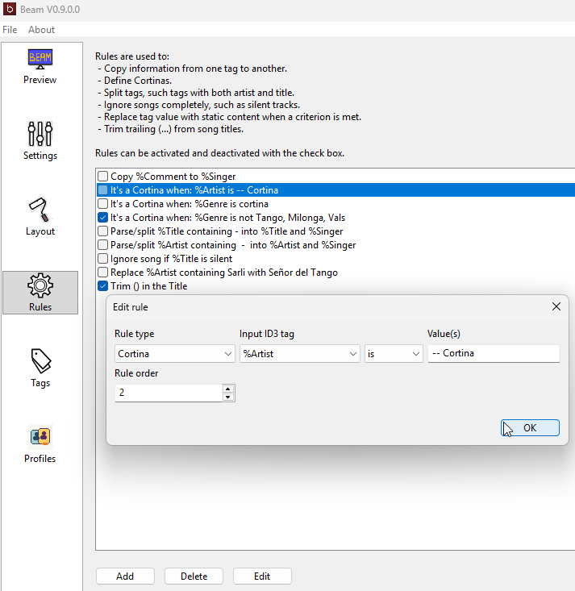

# User Manual: Rules

Rules let Beam adjust song information before it is shown on screen.

This is useful when your music files are technically correct for your player, but not ideal for a public display.

## What Rules Are For

Rules can help Beam:

- copy information from one field to another
- mark a song as a cortina
- split a field that contains multiple pieces of information
- ignore tracks that should never be shown
- replace one displayed value with another
- trim trailing `( ... )` text from titles

## Common Examples

### Detecting Cortinas

You can create a rule that marks a song as a cortina when a field matches a value.

Examples:

- `%Genre` is `cortina`
- `%Genre` is not `Tango, Milonga, Vals`

### Cleaning Up Titles

Beam includes a default optional rule called `Trim () in the Title`.

This can turn:

- `Malena (Take 1)` into `Malena`
- `El Pollito (test press)` into `El Pollito`

### Ignoring Unwanted Tracks

If your library contains silent tracks, announcements, or helper files, you can create an `Ignore` rule so they never appear in the display.

## When To Use Rules

Use rules when:

- the player sends metadata that is not clean enough for projection
- you want more reliable cortina detection
- you want the public display to look simpler than the original file tags

Do not use rules if the metadata already looks correct and you do not need any cleanup.

## Keep Rules Simple

Start with one rule at a time.

After adding or changing a rule:

1. click `Apply`
2. play one known track
3. check the preview
4. confirm the display shows what you expected

This makes it much easier to understand which rule changed the result.

## Related Pages

- [User Manual - Customize the Display.md](User%20Manual%20-%20Customize%20the%20Display.md)
- [User Manual - Troubleshooting.md](User%20Manual%20-%20Troubleshooting.md)
- [Display Tags.md](Display%20Tags.md)
