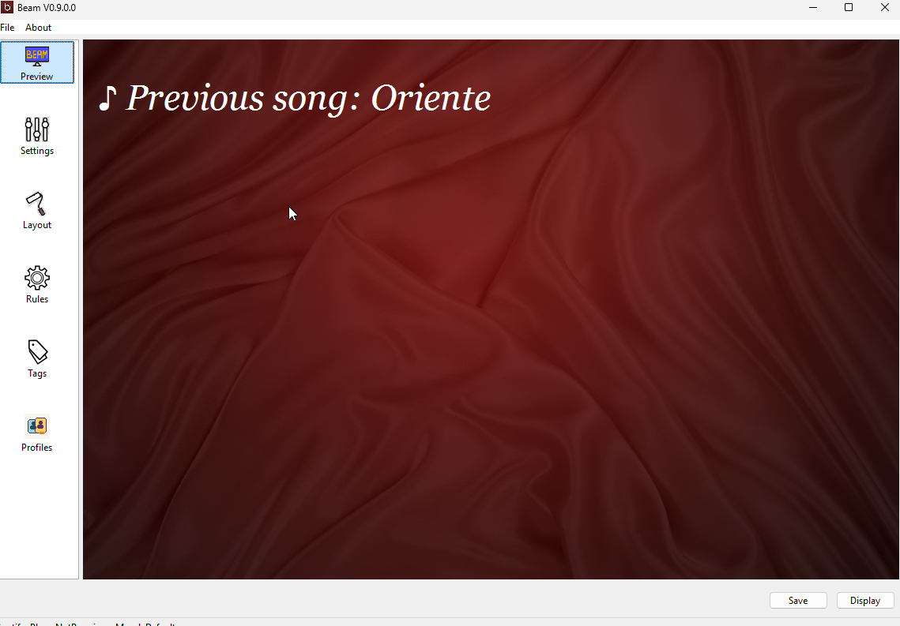
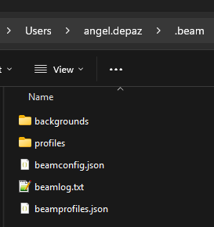

# User Manual: Troubleshooting

If Beam is not working, start with the symptom you see.

## Beam Opens But Shows No Song

Check:

- your music player is selected correctly
- the player is running
- a song is actually playing
- you clicked `Apply` after changing settings

## Beam Shows the Wrong Song or No Updates

Check:

- the player-specific setup is complete
- the connection settings are correct
- Beam is using the correct integration mode
- the player is not paused or stopped

## The Display Window Opens on the Wrong Screen

Move the window manually to the correct monitor.

Then use full screen mode if needed.

Windows display order can change after reconnecting screens, docks, or projectors.

## The Text Is Hard To Read

Check:

- font size
- font color
- background brightness
- artist overlay opacity
- title wrapping and layout spacing

## The Browser Display Does Not Open

Check:

- network display is enabled
- the correct address is being opened
- the phone or tablet is on the same network
- firewall rules are not blocking Beam

## Beam Worked Before But Not After a Change

Try this:

1. reopen Beam
2. confirm the correct player is selected
3. re-apply settings
4. test with one known song
5. simplify the setup until the basic preview works again

## Where To Find The Log File

Beam writes its log file as `beamlog.txt` inside your user home folder under `.beam`.

Typical location on Windows:

- `C:\Users\<your-user-name>\.beam\beamlog.txt`

If you ask someone technical for help, this is the file to share.

## Recommended Log Level

Beam stores its log level in the file `beamconfig.json` inside the same `.beam` folder.

The setting name is `LogLevel`.

Recommended values:

- `Info` for normal day-to-day use
- `Debug` when you are troubleshooting a problem or someone asks you for more detailed logs

If Beam is working normally, keep it on `Info`.

If something is failing or behaving strangely, switch it to `Debug`, repeat the problem once, then check `beamlog.txt` again.

## Still Stuck?

Use:

- [FAQ.md](FAQ.md)
- [User Manual - Player Setup.md](User%20Manual%20-%20Player%20Setup.md)
- `beamlog.txt` if someone technical is helping you
- Report an issue in https://github.com/MrNidnan/beam-project/issues
